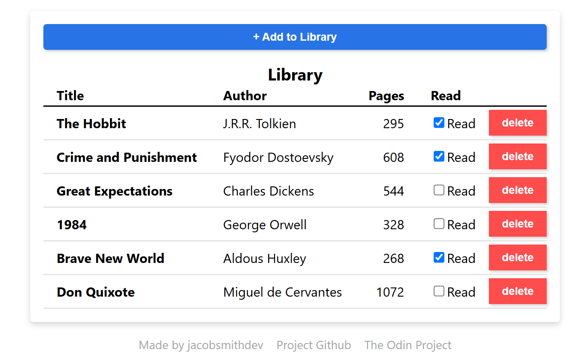

# library-top
My repository for The Odin Project's [library](https://www.theodinproject.com/lessons/node-path-javascript-library).

## Live Preview
See a [live preview](https://jacobsmithdev.github.io/library-top/).

## Features
 - Uses object array to track book data
 - Allows user to add/remove books, and change read status via html page

## Built with
 - Javascript
 - CSS
 - HTML

## References
 - [The Odin Project](https://www.theodinproject.com/dashboard)
 - [The Odin Project - Library](https://www.theodinproject.com/lessons/node-path-javascript-library)
 - [BEM Naming Convention for CSS](https://getbem.com/naming/)